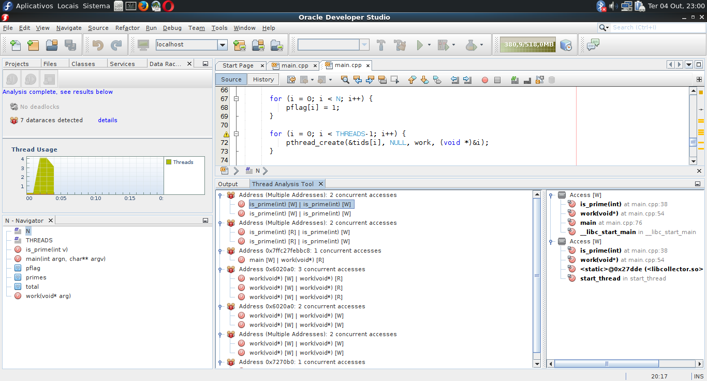

# Programação de Alto Desempenho
Alunos: Matheus Ronsani de Figueiredo e Ricardo Bianchim Gomes    
Professora Andrea Schwertner Charão  
2016/2  

##Ferramentas de Detecção de DataRacing
Códigos paralelos, em geral, são difíceis de depurar, sendo que a identificação de um data race pode não ser trivial. Desta forma, torna-se necessária a utilização de ferramentas automatizadas para detecção de data races.  
Os Exemplos apresentados no arquivo [Exemplos.md](./Exemplos.md) foram submetidos a análise em ferramentas de detecção de data race: [ValGrind](http://valgrind.org/docs/manual/drd-manual.html) e [Oracle Developer Studio 12.5](https://www.oracle.com/tools/developerstudio/index.html) (antigo Sun/Oracle Solaris Studio). A seguir serão apresentados as telas dos programas, juntamente com os resultados obtidos através das verificações.

##1. Apresentação da IDE Oracle Developer Studio (ODS)

A figura 1 apresenta uma visão geral de uma das ferramentas utilizadas, a ODS. Esta ferramenta é capaz de analisar a execução de programas escritos em C, C++ e Fortran. Nota-se uma interface muito similar à da IDE NetBeans. Os campos enumerados na imagem são:  
 1) Projetos abertos: contém todos os projetos abertos e a árvore de arquivos a ele pertencentes.  
 2) Barra de arquivos abertos e área de edição;
 3) Botão analisar programa: abre o menu de seleção de tipo de análise;  
 4) Seleção de tipo de análise: permite selecionar diversos tipos de análise de execução dos códigos. Em especial, estamos interessados na análise de data races.

###1.1 Análise do programa Exemplo2.cpp

Conforme citado na tabela em [exemplos.md](Exemplos.md), o código do arquivo Exemplo2 possui um data race peculiar: ocorre em torno da variável "owner", a qual é utilizada para garantir acesso em exclusão mútua a uma região crítica. Porém, a atualização desta variável não é sincronizada, o que permite que threads diferentes tenham visões diferentes sobre de quem é a vez de entrar na região crítica.  
  
A Figura 2 apresenta a saída do analisador. No campo 1 normalmente são exibidos os erros encontrados (ex.: data races) e a quantidade de threads criadas. Nota-se que neste caso, o profiler não computou o número de threads, devido ao fato de que o tempo de execução foi muito breve (poucos ms). Nota-se ainda que para este exemplo, o analisador não encontrou data races, embora existam.

###1.1 Análise do programa Exemplo3.cpp
A Figura 3 exibe a tela obtida ao se verificar o código do exemplo 3. Inspecionando manualmente o código, concluiu-se que havia DR em torno da variável mMoney (conforme tabela de exemplos.)  

Como pode ser observado, pelo campo 1 da figura 3, a ferramenta identificou a ocorrência de 1 data race, confirmando os resultados da análise manual. O campo 2 mostra o gráfico da criação de threads durante o tempo de execução do programa. No campo 3, é possível identificar que a IDE marca a linha do código onde ocorre o DR. O campo 4 apresenta informações sobre o problema: no método addMoney existe uma corrida de dados do tipo Write.

###1.1 Análise do programa Exemplo5.cpp
Através da Figura 4, é possível observar a ocorrência de corrida de dados no exemplo 4, mais precisamente dentro do laço for. A ferramenta indica a ocorrência de duas corridas, porém, apenas uma de fato acontece.	

###1.1 Análise do programa LastPrivate.c
Conforme é possível de se visualizar na figura 5 e de acordo com a análise visual do código, não existem data races neste código.  

###1.1 Análise do programa OMP_Prime.c
Como pode ser observado na Figura 6, as corridas de dados encontradas na inspeção visual do código são confirmadas pela ferramenta.

###1.1 Análise do programa Pthread_Prime.c
As Figuras 7 e 8 apresentam os resultados obtidos na verificação do código PThread_prime.c. Inicialmente, haviam sido identificados a ocorrência de duas situações de data race: em torno de uma variável índice de um vetor, e no acesso ao vetor em si. Porém, a ferramenta identificou um total de 7 ocorrências de tata race no código.
  

###1.1 Análise do Exemplo Programa1.c
Conforme pode ser observado pela figura 9, o analisador confirma a ocorrência de data race em torno da variável "total", o qual havia sido identificado na inspeção visual do código.  
