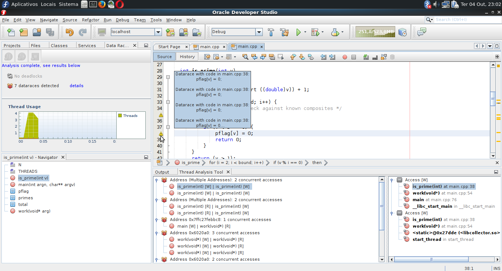

# Programação de Alto Desempenho
Alunos: Matheus Ronsani de Figueiredo e Ricardo Bianchim Gomes    
Professora Andrea Schwertner Charão  
2016/2  

##Ferramentas de Detecção de DataRacing
Códigos paralelos, em geral, são difíceis de depurar, sendo que a identificação de um data race pode não ser trivial. Desta forma, torna-se necessária a utilização de ferramentas automatizadas para detecção de data races.  
Os Exemplos apresentados no arquivo [Exemplos.md](./Exemplos.md) foram submetidos a análise em ferramentas de detecção de data race: [ValGrind](http://valgrind.org/docs/manual/drd-manual.html) e [Oracle Developer Studio 12.5](https://www.oracle.com/tools/developerstudio/index.html) (antigo Sun/Oracle Solaris Studio). A seguir serão apresentados as telas dos programas, juntamente com os resultados obtidos através das verificações.

##1. Apresentação da IDE Oracle Developer Studio (ODS)

A figura 1 apresenta uma visão geral de uma das ferramentas utilizadas, a ODS. Esta ferramenta é capaz de analisar a execução de programas escritos em C, C++ e Fortran. Nota-se uma interface muito similar à da IDE NetBeans. Os campos enumerados na imagem são:  
 1) Projetos abertos: contém todos os projetos abertos e a árvore de arquivos a ele pertencentes.  
 2) Barra de arquivos abertos e área de edição;
 3) Botão analisar programa: abre o menu de seleção de tipo de análise;  
 4) Seleção de tipo de análise: permite selecionar diversos tipos de análise de execução dos códigos. Em especial, estamos interessados na análise de data races.


###1.1 Análise do programa Exemplo2.cpp

Conforme citado na tabela em [exemplos.md](Exemplos.md), o código do arquivo Exemplo2 possui um data race peculiar: ocorre em torno da variável "owner", a qual é utilizada para garantir acesso em exclusão mútua a uma região crítica. Porém, a atualização desta variável não é sincronizada, o que permite que threads diferentes tenham visões diferentes sobre de quem é a vez de entrar na região crítica.  
  
A Figura 2 apresenta a saída do analisador. No campo 1 normalmente são exibidos os erros encontrados (ex.: data races) e a quantidade de threads criadas. Nota-se que neste caso, o profiler não computou o número de threads, devido ao fato de que o tempo de execução foi muito breve (poucos ms). Nota-se ainda que para este exemplo, o analisador não encontrou data races, embora existam.

###1.2 Análise do programa Exemplo3.cpp
A Figura 3 exibe a tela obtida ao se verificar o código do exemplo 3. Inspecionando manualmente o código, concluiu-se que havia DR em torno da variável mMoney (conforme tabela de exemplos.)  

Como pode ser observado, pelo campo 1 da figura 3, a ferramenta identificou a ocorrência de 1 data race, confirmando os resultados da análise manual. O campo 2 mostra o gráfico da criação de threads durante o tempo de execução do programa. No campo 3, é possível identificar que a IDE marca a linha do código onde ocorre o DR. O campo 4 apresenta informações sobre o problema: no método addMoney existe uma corrida de dados do tipo Write.

###1.3 Análise do programa Exemplo5.cpp
Através da Figura 4, é possível observar a ocorrência de corrida de dados no exemplo 4, mais precisamente dentro do laço for. A ferramenta indica a ocorrência de duas corridas, porém, apenas uma de fato acontece.	


###1.4 Análise do programa LastPrivate.c
Conforme é possível de se visualizar na figura 5 e de acordo com a análise visual do código, não existem data races neste código.  


###1.5 Análise do programa OMP_Prime.c
Como pode ser observado na Figura 6, as corridas de dados encontradas na inspeção visual do código são confirmadas pela ferramenta.


###1.6 Análise do programa Pthread_Prime.c
As Figuras 7 e 8 apresentam os resultados obtidos na verificação do código PThread_prime.c. Inicialmente, haviam sido identificados a ocorrência de duas situações de data race: em torno de uma variável índice de um vetor, e no acesso ao vetor em si. Porém, a ferramenta identificou um total de 7 ocorrências de tata race no código.
  


###1.7 Análise do Exemplo Programa1.c
Conforme pode ser observado pela figura 9, o analisador confirma a ocorrência de data race em torno da variável "total", o qual havia sido identificado na inspeção visual do código.  


##2. Valgrind

O Valgrind é um conjunto de ferramentas, baseado em linhas de comando, que servem tanto para debbuging como para profiling de uma aplicação. Disponível para Linux, ele é capaz de trabalhar com programas em C/C++, Java, Fortran, Python, Perl, etc.
Composto por 4 ferramentas :
1. Memcheck : Detector de erros em memória ( Memory Leak , data racing, aetc).
2. Cachegrind : Simulador de cache.
3. Callgrind : Profiler para grafo de chamadas.
4. Massif : Profiler para heap.

###2.1 Análise do programa Exemplo3.cpp
Analisando o [log](Logs/exemplo3.log) gerado pelo valgrind do Exemplo3, podemos perceber que ele detecta dois conflitos na função addMoney(int) sobre o mesmo endereço de memória, a mesma variável no caso.
```
(linhas 7-9)
==2898== Thread 3:
==2898== Conflicting load by thread 3 at 0xffefffd20 size 4
==2898==    at 0x401626: Wallet::addMoney(int) (exemplo3.cpp:20)
...
(linhas 24-25)
==2898== Conflicting store by thread 3 at 0xffefffd20 size 4
==2898==    at 0x40162F: Wallet::addMoney(int) (exemplo3.cpp:20)
```

###2.2 Análise do programa Exemplo5.cpp
Podemos perceber com o [log](Logs/exemplo5.log) do Exemplo5 que são detectados 3 conflitos sobre a mesma variável.
```
(linhas 7-9)
==7928== Thread 3:
==7928== Conflicting load by thread 3 at 0xffefffd98 size 4
==7928==    at 0x40089F: main._omp_fn.0 (exemplo5.c:22)
...
(linhas 25-26)
==7928== Conflicting store by thread 3 at 0xffefffd98 size 4
==7928==    at 0x4008A8: main._omp_fn.0 (exemplo5.c:22)
...
(linhas 42-44)
==7928== Thread 1:
==7928== Conflicting load by thread 1 at 0xffefffd98 size 4
==7928==    at 0x400815: main (exemplo5.c:18)
```


###2.3 Análise do programa LastPrivate.c
Com o  [log](Logs/last_private.log) podemos ver que existe apenas um data race nesse código. Ele acusa apenas um conflito, e esse conflito é uma leitura.
```
(linhas 14-15)
==4048== Conflicting load by thread 1 at 0xffefffd94 size 4
==4048==    at 0x400969: main (last_private.c:32)
```


###2.4 Análise do programa Prime_OMP.c
Analisando o [log](Logs/prime_omp.log) é possível perceber que 3 variáveis estão com conflitos.
1. 0x006010b0
2. 0xffefffd90
3. 0x00604194

```
(linhas 9-10)
==4025== Conflicting load by thread 2 at 0x006010b0 size 4
==4025==    at 0x400929: is_prime 
...
(linhas 34-35)
==4025== Conflicting load by thread 2 at 0xffefffd90 size 4
==4025==    at 0x400AC4: main._omp_fn.0
...
(linhas 58-59)
==4025== Conflicting load by thread 2 at 0xffefffd90 size 4
==4025==    at 0x400AD6: main._omp_fn.0 
...
(linhas 82-83)
==4025== Conflicting store by thread 2 at 0xffefffd90 size 4
==4025==    at 0x400ADF: main._omp_fn.0 
...
(linhas 107-108)
==4025== Conflicting load by thread 1 at 0xffefffd90 size 4
==4025==    at 0x4009F1: main
...
(linhas 142-143)
==4025== Conflicting load by thread 1 at 0x00604194 size 4
==4025==    at 0x400A1E: main 
```

###2.5 Análise do programa  Prime_Pthread.c
É possível ver no [log](Logs/prime_pthread.log) que existem 4 data races, nas variáveis

1. 0xffefffd7c
2. 0x00601090
3. 0x00601064
4. 0x00603f60

```
(linhas 8-9)
==4036== Conflicting store by thread 1 at 0xffefffd7c size 4
==4036==    at 0x4008E2: main (prime_pthread.c:55)
...
(linhas 19-20)
==4036== Conflicting load by thread 3 at 0x00601090 size 4
==4036==    at 0x4007A9: is_prime (prime_pthread.c:19)
...
(linhas 32-33)
==4036== Conflicting load by thread 3 at 0x00601064 size 4
==4036==    at 0x40082D: work (prime_pthread.c:39)
...
(linhas 44-45)
==4036== Conflicting load by thread 3 at 0x00601064 size 4
==4036==    at 0x40083F: work (prime_pthread.c:40)
...
(linhas 56-57)
==4036== Conflicting store by thread 3 at 0x00601064 size 4
==4036==    at 0x400848: work (prime_pthread.c:40)
...
(linhas 69-70)
==4036== Conflicting store by thread 1 at 0xffefffd7c size 4
==4036==    at 0x4008ED: main (prime_pthread.c:59) 
...
(linhas 99-100)
==4036== Conflicting load by thread 1 at 0x00601090 size 4
==4036==    at 0x4007A9: is_prime (prime_pthread.c:19)
...
(linhas 111-112)
==4036== Conflicting load by thread 1 at 0x00601064 size 4
==4036==    at 0x40082D: work (prime_pthread.c:39)
...
(linhas 130-131)
==4036== Conflicting load by thread 1 at 0x00601064 size 4
==4036==    at 0x40083F: work (prime_pthread.c:40)
...
(linhas 149-150)
==4036== Conflicting store by thread 1 at 0x00601064 size 4
==4036==    at 0x400848: work (prime_pthread.c:40)
...
(linhas 168-169)
==4036== Conflicting load by thread 1 at 0x00601064 size 4
==4036==    at 0x400900: main (prime_pthread.c:62)
...
(linhas 186-187)
==4036== Conflicting store by thread 1 at 0xffefffd7c size 4
==4036==    at 0x40091C: main (prime_pthread.c:64)
...
(linhas 216-217)
==4036== Conflicting load by thread 1 at 0x00601064 size 4
==4036==    at 0x40094E: main (prime_pthread.c:64)
...
(linhas 234-235)
==4036== Conflicting load by thread 1 at 0x00603f60 size 4
==4036==    at 0x40092A: main (prime_pthread.c:65)
...
(linhas 244-245)
==4036== Conflicting store by thread 1 at 0xffefffd7c size 4
==4036==    at 0x400948: main (prime_pthread.c:64)
```

###2.6 Análise do programa Programa1.c
No [log](Logs/programa1.log) pode-se perceber que o programa possui 5 data races em cima das seguintes variáveis:

1. 0xffefffd94
2. 0xffefffd98
3. 0x05858d96
4. 0x05858d97
5. 0x05858da7

```
(linhas 9-10)
==4042== Conflicting store by thread 2 at 0xffefffd94 size 4
==4042==    at 0x40098C: main._omp_fn.0 (programa1.c:14)
...
(linhas 29-30)
==4042== Conflicting load by thread 2 at 0xffefffd94 size 4
==4042==    at 0x400993: main._omp_fn.0 (programa1.c:16)
...
(linhas 49-50)
==4042== Conflicting load by thread 2 at 0xffefffd94 size 4
==4042==    at 0x4009A2: main._omp_fn.0 (programa1.c:20)
...
(linhas 68-69)
==4042== Conflicting store by thread 2 at 0x05858d96 size 1
==4042==    at 0x4C4506C: __GI_mempcpy 
...
(linhas 102-103)
==4042== Conflicting store by thread 2 at 0x05858d97 size 1
==4042==    at 0x4C4508C: __GI_mempcpy 
...
(linhas 135-136)
==4042== Conflicting store by thread 2 at 0x05858da7 size 1
==4042==    at 0x4C4506C: __GI_mempcpy 
...
(linhas 168-169)
==4042== Conflicting store by thread 2 at 0xffefffd98 size 4
==4042==    at 0x4009C3: main._omp_fn.0 (programa1.c:25)
...
(linhas 191-192)
==4042== Conflicting store by thread 1 at 0xffefffd98 size 4
==4042==    at 0x4009C3: main._omp_fn.0 (programa1.c:25)
...
(linhas 224-225)
==4042== Conflicting load by thread 4 at 0xffefffd98 size 4
==4042==    at 0x400A50: main._omp_fn.0 (programa1.c:30)
...
(linhas 149-150)
==4036== Conflicting store by thread 1 at 0x00601064 size 4
==4036==    at 0x400848: work (prime_pthread.c:40)
...
(linhas 269-270)
==4042== Conflicting load by thread 4 at 0xffefffd94 size 4
==4042==    at 0x400A5D: main._omp_fn.0 (programa1.c:30)
...
(linhas 315-316)
==4042== Conflicting load by thread 1 at 0xffefffd98 size 4
==4042==    at 0x400A50: main._omp_fn.0 (programa1.c:30)
...
(linhas 353-354)
==4042== Conflicting load by thread 1 at 0xffefffd94 size 4
==4042==    at 0x400A5D: main._omp_fn.0 (programa1.c:30)
...
(linhas 397-398)
==4042== Conflicting load by thread 1 at 0xffefffd94 size 4
==4042==    at 0x40093B: main (programa1.c:11)
...
(linhas 438-439)
==4042== Conflicting load by thread 1 at 0xffefffd98 size 4
==4042==    at 0x400941: main (programa1.c:11)
```

## Ferramenta Data Race Detector - DRD (Java)
A ferramenta Data Race Detector consiste em um java agent que deve ser conectado à JVM, passando-o como argumento na mesma linha de comando em que se invoca a execução do programa que será analisado.  
  
  
A saída deste analisador consiste principalmente de dois logs, criados dentro de um diretório especificado pelo usuário, no arquivo de configurações.
O primeiro arquivo é o drd.log. Em especial, deve-se observar o campo "races", no final do arquivo (figura 11).
  
  
O segundo arquivo é o drd_races.log. Este arquivo contém informações detalhadas de cada ocorrência de race no código java. Exemplo de informações encontradas são: momento e thread em que o race ocorreu, linha do código que contém a instrução causadora do race (figura 12).
  

Os logs de cada exemplo .java econtram-se disponíveis na pasta "logs" deste projeto.

#3. Comparação entre as ferramentas ODS e Valgrind
Nessa seção é feito um resumo dos resultados encontrados. Na tabela é possível perceber rapidamente o número de data races encontrados em cada exemplo por cada ferramenta.

| Programa\Ferramenta 	| ODS 	|  Valgrind 	|
|:-------------------:	|:---:	|:---------:	|
|     Exemplo2.cpp    	|  1  	|     x     	|
|     Exemplo3.cpp    	|  1  	|     1     	|
|     Exemplo5.cpp    	|  2  	|     1     	|
|    LastPrivate.c    	|  0  	|     1     	|
|     Prime_OMP.c     	|  3  	|     3     	|
|   Prime_Pthread.c   	|  7  	|     4     	|
|     Programa1.c     	|  2  	|     5     	|
